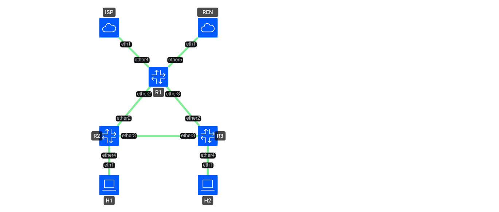

# Containerlab campus eBGP testbed

This lab implements the following miniature campus topology:



R1 is the campus edge. R1, R2, and R3 form one OSPF area 0 triangle. R1 has
eBGP sessions to ISP and IDREN. IDREN is preferred for a shared prefix by an
inbound local-preference policy on R1: IDREN 200, ISP 100. R1 redistributes
the selected generated BGP routes into OSPF as external type 1 routes with
metric 20, while only advertising the two campus LANs back to the eBGP peers.

The generated BGP prefixes are control-plane test routes. There is no host or
service behind those prefixes, so they validate BGP path selection, local-pref,
AS paths, and OSPF external propagation rather than end-to-end ping.

## Requirements

- Containerlab and Docker.
- GNU Make, Bash, Python 3.10 or newer with the `pexpect` package, and an
  OpenSSH client. These host tools drive route generation, local tests, and
  RouterOS validation over SSH.
- An x86_64 host with KVM available (`/dev/kvm`) is strongly recommended for
  the three QEMU-backed RouterOS nodes. This lab has been validated on this
  host with Docker and `/dev/kvm` access for the current user.
- A local `vrnetlab/mikrotik_routeros:7.21.5` image. The exact RouterOS patch
  is intentionally pinned.

### Build the RouterOS image

Use the Containerlab-compatible `srl-labs/vrnetlab` fork and the official CHR
VMDK for RouterOS 7.21.5:

```bash
git clone https://github.com/srl-labs/vrnetlab /tmp/vrnetlab
cd /tmp/vrnetlab/mikrotik/routeros
curl -LO https://download.mikrotik.com/routeros/7.21.5/chr-7.21.5.vmdk.zip
unzip chr-7.21.5.vmdk.zip
make docker-image
```

The resulting tag should be `vrnetlab/mikrotik_routeros:7.21.5`, which is the
image referenced by [clab.yml](clab.yml). The build instructions and required
kind are documented by [vrnetlab](https://github.com/srl-labs/vrnetlab/tree/master/mikrotik/routeros)
and [Containerlab](https://containerlab.dev/manual/kinds/vr-ros/).

## Run the lab

From this directory:

```bash
make test
make generate
make images
containerlab deploy -t clab.yml --reconfigure
```

`make images` builds:

- `local/campus-endpoint:12`: Debian endpoint with DHCP client, ping,
  traceroute, tcpdump, and IP tools.
- `local/campus-exabgp:5.0.9`: the official
  [ExaBGP 5.0.9](https://pypi.org/project/exabgp/5.0.9/) image plus `iproute2`
  for the data-facing interface. The generated files use ExaBGP's documented
  [static-route syntax](https://github.com/Exa-Networks/exabgp/wiki/Configuration-Syntax).

Both helper Dockerfiles pin their upstream image by immutable digest, install
from the dated Debian Snapshot archive, and pin every requested package
version. Direct and transitive package resolution therefore remains fixed;
updating a build input is an explicit maintenance change.

The combined shortcut is `make deploy` after the RouterOS image exists.

The lab-only RouterOS console/SSH credential configured by the startup files is
`admin` / `lab-routeros-7.21.5`.

## Acceptance test

The final reachability test is exactly the requested one: both endpoints must
receive DHCP, then H1 must be able to ping and traceroute to H2.

```bash
make validate
```

The helper prints the leased addresses, runs three ICMP probes, and runs a
numeric traceroute. It then asserts both eBGP sessions, the 500/200 received
route counts, two Full OSPF neighbors on each router, and policy behavior for a
shared prefix selected from `generated/manifest.json`. On R1, IDREN must be the
active path with local-pref 200 while ISP remains the candidate at 100. R2 and
R3 must install that prefix as an active OSPF external type 1 route. The
validation also reads R1's OSPF link-state database and asserts the originated
external LSA carries type 1 and metric 20. A downstream route's displayed
metric additionally includes its internal cost to R1.

## Failure tests

```bash
make failure-tests
```

The helper first flaps R1's ISP- and IDREN-facing links independently. It
asserts that the relevant R1 received-route count falls from the generated
manifest baseline to zero and returns to that baseline. H1/H2 campus reachability remains available
throughout. Recovery is natural: the test verifies that the ExaBGP process ID
does not change across either link flap and does not signal or restart the
speaker.

It then automates the R2-R3 campus-core failure and asserts all three states:

1. Normal: H1-to-H2 uses `R2 -> R3`, with successful ping.
2. R2-R3 down: OSPF reconverges over `R2 -> R1 -> R3`, with successful ping.
3. R2-R3 restored: the path returns to `R2 -> R3`, with successful ping.

The core-link scenario polls traceroute for convergence and uses an exit trap
to restore the R2-R3 link if any assertion or command fails.

## Address plan

| Segment | Prefix | Endpoints |
| --- | --- | --- |
| Management | `172.20.20.0/24` | R1 `.11`, R2 `.12`, R3 `.13`, ISP `.21`, IDREN `.22`, H1 `.31`, H2 `.32` |
| R1 loopback | `10.255.0.1/32` | R1 |
| R2 loopback | `10.255.0.2/32` | R2 |
| R3 loopback | `10.255.0.3/32` | R3 |
| R1-R2 | `10.255.1.0/30` | R1 `.1`, R2 `.2` |
| R2-R3 | `10.255.1.4/30` | R2 `.5`, R3 `.6` |
| R1-R3 | `10.255.1.8/30` | R1 `.9`, R3 `.10` |
| R1-ISP | `10.255.2.0/30` | R1 `.1`, ISP `.2` |
| R1-IDREN | `10.255.2.4/30` | R1 `.5`, IDREN `.6` |
| H1 LAN | `10.255.10.0/24` | R2 gateway `.1`, DHCP `.100-.199` |
| H2 LAN | `10.255.20.0/24` | R3 gateway `.1`, DHCP `.100-.199` |
| Generated routes | `10.64.0.0/10` | control-plane only |

## Reproducible route generation

The defaults are deterministic and can be overridden without editing the
topology:

```bash
make generate \
  SEED=42 \
  ISP_PREFIXES=500 \
  IDREN_PREFIXES=200 \
  IDREN_DIRECT_PREFIXES=100 \
  IDREN_TRANSIT_PREFIXES=100 \
  SHARED_PREFIXES=50
```

The generator keeps prefixes non-overlapping except for the intentional shared
set. IDREN's 200 routes are split into 100 direct-source routes across up to
10 source ASes and 100 routes whose path contains `141682` across up to 50
source ASes. The default shared set contains 25 of each category. ISP paths
contain deterministic synthetic AS paths of length 0 through 5.
The generated pool (`10.64.0.0/10`), prefix-length range (`/16` through `/24`),
and local-preference policy (ISP 100, IDREN 200) are fixed lab invariants.

Generated files are `generated/isp.conf`, `generated/idren.conf`, and
`generated/manifest.json`. RouterOS startup files are under
`configs/routeros/`; R1's local-pref values are rendered from
`configs/routeros/r1.rsc.tmpl`, while R2 and R3 share
`configs/routeros/core.rsc.tmpl` and a single router-data model.

## Cleanup

```bash
containerlab destroy -t clab.yml
```

## Contributing

Contributions are welcome. Read [CONTRIBUTING.md](CONTRIBUTING.md) for the
development workflow, verification expectations, generated-file policy, and
Conventional Commit conventions. Participation is governed by the
[Code of Conduct](CODE_OF_CONDUCT.md).

[Abazh](https://github.com/Abazh) is the project's initial contributor. See
[CONTRIBUTORS.md](CONTRIBUTORS.md) for project attribution.

Please report suspected vulnerabilities privately according to
[SECURITY.md](SECURITY.md), not through a public bug report.

## License

This project is available under the [MIT License](LICENSE).
